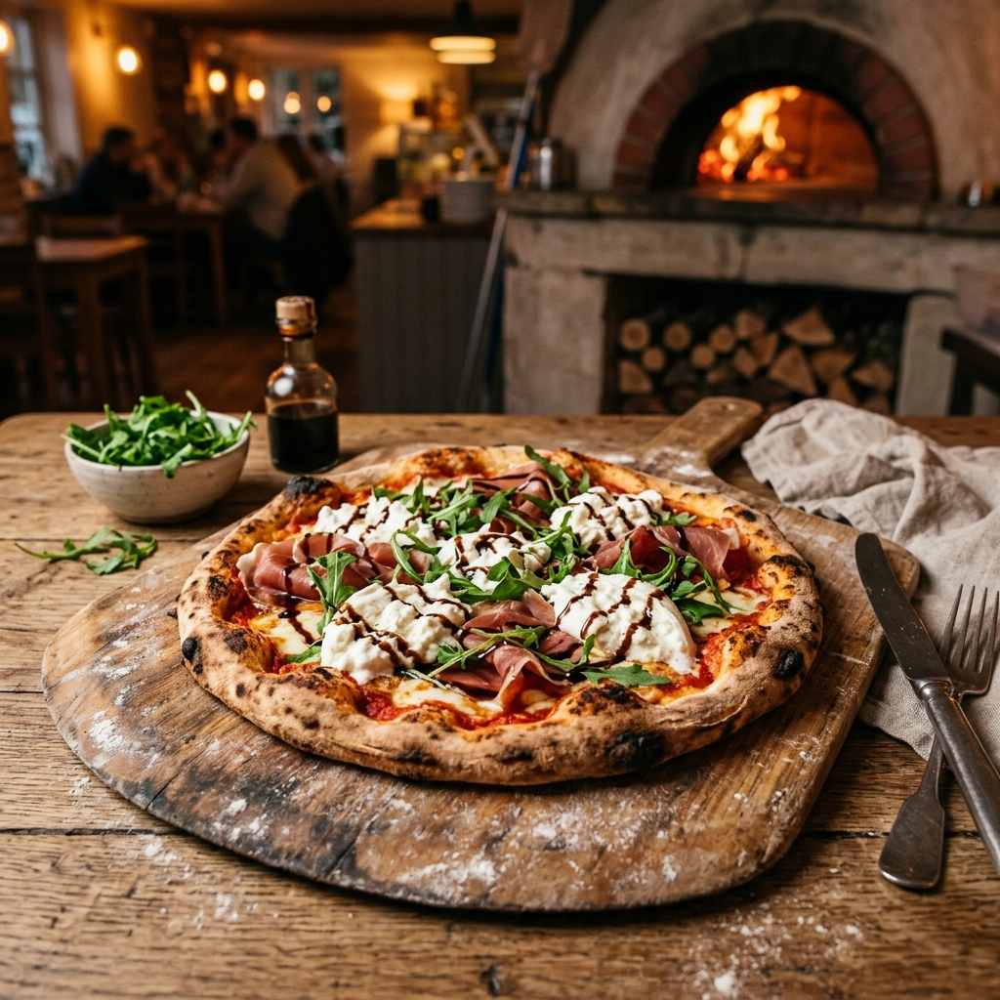
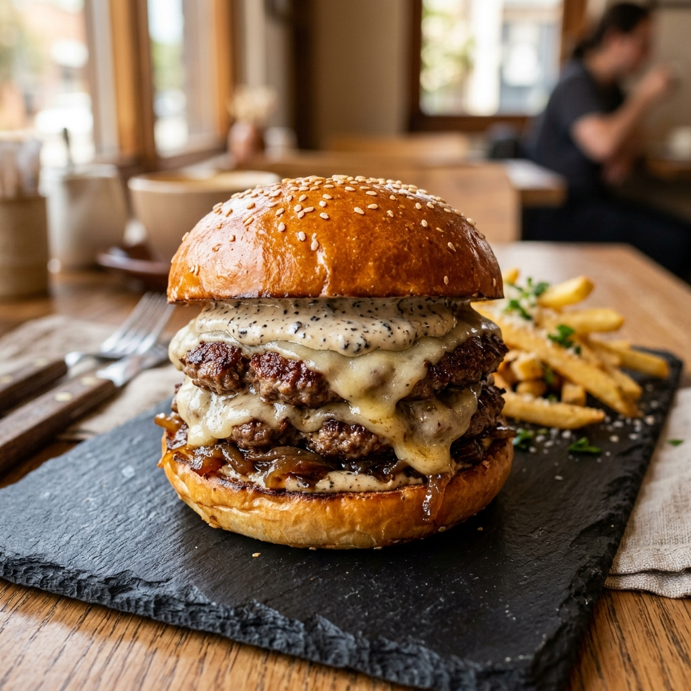

# ☕ Brew & Bite — Artisanal Café & Bistro Prototype

Welcome to **Brew & Bite**, a modern, responsive web application for an artisanal café & bistro located in **Karvenagar, Pune, Maharashtra**. 

Brew & Bite combines a cozy aesthetic with high-performance engineering—pairing a sleek **React + Vite** frontend with a high-speed **C++17 HTTP backend** and custom C-compiled input validation.

---

## 📸 Menu Preview

| 🍕 Burrata & Prosciutto Pizza | 🍔 Truffle & Mushroom Burger | ☕ Cold Brew Coffee | ☕ Artisan Flat White |
| :---: | :---: | :---: | :---: |
|  |  |  |  |

---

## ✨ Features

- **📖 Interactive Menu**: Browse specialty coffees, smash burgers, sourdough pizzas, and desserts priced in **₹ (INR)** with dish tags (*Vegetarian*, *Chef Special*, *Gluten-Free*).
- **📅 Table Reservations**: Reserve tables with real-time slot availability, party size selection, and optional food pre-ordering.
- **⚡ Native C++ Backend**: Blazing fast HTTP API server compiled in C++17 (`httplib`) with instant JSON response handling.
- **🛡️ Secure Input Validation**: C-compiled validation module for sanitizing booking details, Indian mobile numbers (+91), and email formats.
- **📱 Fully Responsive**: Crafted using Tailwind CSS v4 with glassmorphism UI, smooth scroll transitions, and mobile drawer navigation.

---

## 🛠️ Tech Stack

- **Frontend**: React 18, Vite, Tailwind CSS v4, Lucide Icons
- **Backend**: C++17 (using `httplib` & `nlohmann/json`)
- **Validation Engine**: C (compiled natively and WASM capable)
- **Data Storage**: Local JSON file storage (`data/menu.json`)

---

## 📁 Project Structure

```text
brew-and-bite/
├── client/              # React + Vite Frontend
│   ├── src/             # React components, pages, and hooks
│   └── public/images/   # High-res menu and banner images
├── native/              # Backend Source Code
│   ├── cpp/             # C++ HTTP server & storage logic
│   └── c/               # C input validation logic
├── data/                # Database JSON files (menu, slots)
├── Makefile             # C++ Server Build Automation
└── README.md            # Project documentation
```

---

## 🚀 Quick Start Guide

### 1. Prerequisites
- **GCC / MinGW** (for building C++ backend)
- **Node.js v18+** & **npm** (for running frontend)

### 2. Environment Setup
Copy the example environment file:
```bash
cp .env.example .env
```

### 3. Run the Backend Server
```bash
# Build & start C++ HTTP server (runs on http://localhost:8080)
make server
./build/server.exe
```

### 4. Run the Frontend App
```bash
cd client
npm install
npm run dev
# Opens on http://localhost:5173
```

---

## 🔌 API Endpoints Summary

| Method | Endpoint | Description |
| :--- | :--- | :--- |
| `GET` | `/api/health` | Server status and uptime check |
| `GET` | `/api/menu` | Fetch full food & beverage menu |
| `GET` | `/api/slots?date=YYYY-MM-DD` | Get available reservation slots |
| `POST` | `/api/bookings` | Submit new table reservation |
| `POST` | `/api/enquiries` | Submit customer contact message |

---

## 📍 Location & Contact

- **Address**: Lane 3, Karvenagar, Pune, Maharashtra 411052, India
- **Phone**: +91 98765 43210
- **Email**: hello@brewandbite.in
- **Hours**: Mon – Sun: 8:00 AM – 11:00 PM

---

*Brew & Bite Prototype — Built with ❤️ for food & coffee lovers.*
